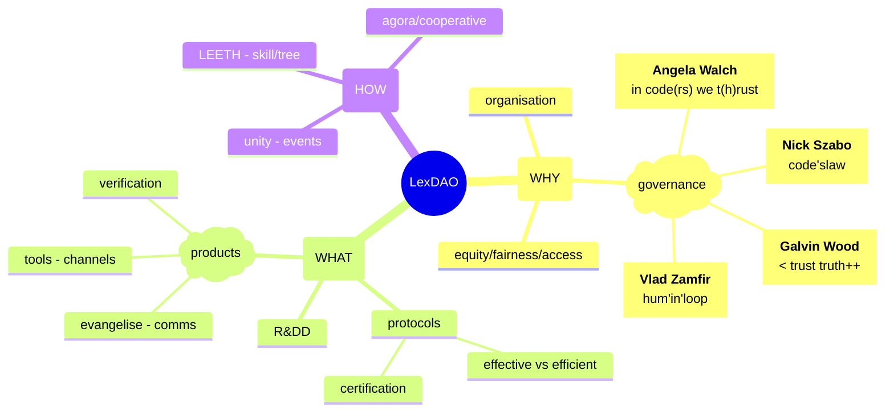

# Constitution as Social Compact

## Non-Discrimination

Under Section 1.5 

> **Section 1.5 - Nondiscrimination.** LexDAO and LexDAO Members shall not arbitrarily discriminate on the basis of race, nationality, religion, age, gender, sexual orientation, disability, political affiliation, or otherwise.  

whilst LexDAO has not consciously discriminated it doesn't alter the fact that the current membership has preponderace of white males from anglosphere. In order to diversify the base and in furtherance of `lex automata pro publica` we commissioned Luis Miranda [^1] and Andres Dovales [^2] for a spanish translation (_unratified_). In a [do-ocracy](https://wiki.osgeo.org/wiki/Do-ocracy) we encourage legal engineers to be proactive in outreach. As spanish is the second most prolific language in the world, actually beating out English, LexDAO anticipates greater participation by meeting prospective members on their own ground.

## Purpose

Drafting _formal treaties_ with legally binding language is non-trivial. With [code deference](https://github.com/lex-node/SCoDA-Simple-Code-Deference-Agreement-/blob/master/DAO%20Charter%20with%20Qualified%20Code%20Deference.md), most of the nuts&bolts are the same (chain specific quirks aside) but the wording needs to be precise and exact when carrying across in the new lingua (and google translate doesn't cut it). Example of poor conceptual transliteration is the Waitangi treaty where `kawanatanga` (governance) is actually a subset of `sovereignty` [rangatiratanga](https://www.waitangitribunal.govt.nz/publications-and-resources/school-resources/treaty-past-and-present/section-3/).

| Legal Expert | Original Concept | Google Translate |
|-----|-----|-----|
|LexDAO se organiza para formar un club de profesionales de ingeniería legal, | organise | LexDAO 旨在组建一个由法律工程专业人士组成的俱乐部，团结起来进行创新，|
| unidos para innovar y llevar la barrera de resolución legal tradicional al código | unite, innovate | 团结起来进行创新，并将传统的法律解决障碍带到代码 |
| y los acuerdos legales codificados a las masas. | coded_agreements | 和编纂的法律协议中给大众。|
| Creemos que todos merecen acceso a la justicia | access |  我们相信，地诉诸司法 |
| proporcionada de manera rápida y eficiente. | efficient vs effective | 每个人都应该快速有效。|
| Si los servicios legales fueran más fáciles de usar, verificar y aplicar, | verify | 如果法律服务更容易使用,验证,和应用，|
| podríamos vivir en un mundo más justo. | fairness | 我们就可以生活在一个更加公正的世界。 |
| La tecnología de registros distribuidos ofrece soluciones a muchos problemas en el espacio legal. | DLT |  分布式账本技术为法律领域的许多问题提供了解决方案。|
| Nuestra misión es investigar, desarrollar y difundir | R&DD | 我们的使命是研究,开发和传播 |
| métodos legales de primera clase y protocolos de blockchain certificados | protocols | 世界一流的法律方法和 LexDAO 认证的区块链协议，
| por LexDAO que aseguren reglas y promesas con código en lugar de confianza. | <trust, truth++ | 通过代码而不是信任来确保规则和承诺。|
| Lo hacemos mediante la capacitación de ingenieros legales certificados por LexDAO | LEETH | 我们通过培训 LexDAO 认证的法律工程师并 |
| y la construcción de aplicaciones blockchain certificadas por LexDAO. | certification | 构建 LexDAO 认证的区块链应用程序来实现这一目标。|
| Nos esforzamos por equilibrar las nuevas herramientas deterministas | tools | 我们努力平衡新的确定性工具 |
| con las consideraciones equitativas de la ley | equity | 与法律的公平考虑，以合作, | 
| para servir mejor a los ciudadanos de manera cooperativa y sin fines de lucro | cooperative | 非营利的方式为公民提供最佳服务，| 
| para el beneficio primario y mutuo de sus miembros y el bien común. | ~~pro publica~~ agora | 以实现其成员的首要互惠利益和共同利益。 |

## Mission Drift
As with any org, there will be mission drift over time. The objective is not to obstruct the entrophy, but to channel it into subsets where it can be focused on defined projects or spun-off into connected entities. The HOW is a matter of (endless) duscussion.

The Spanish ➡️ Chinese ➡️ English, provides some interesting points to consider
1. the notion of time is missing
2. [law](https://en.wikipedia.org/wiki/Chinese_law#:~:text=The%20word%20for%20law%20in,%2C%20measurement%2C%20and%20model%22.) can be translated as either lǐ (理: "order"), lǐ (禮: "rites/decorum"), fǎ (法: "human laws") and zhì (制: "control") which very very loosely maps to Szaboan, Woodoo, Zamfirism and Walchit (don't quote me).
3. [jurisprudence](https://papers.ssrn.com/sol3/papers.cfm?abstract_id=1490104) starts popping up when R&DD hits the deployment stage

  

# Credits

<!-- insert your projects within LexDAO here -->
[^1]: Luis Miranda [linkedin]()

<!-- insert your projects within LexDAO here -->
[^2]: Andres Dovales [linkedin]()
| 
